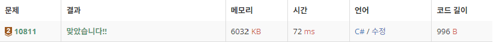

# 10815 바구니 뒤집기

https://www.acmicpc.net/problem/10815

## 문제 이해

배열 뒤집기 문제

C#으로 푸는 문제여서 쉬운걸 골랐는데 너무 쉬웠는지도...

### 입력

첫째 줄에 N (1 ≤ N ≤ 100)과 M (1 ≤ M ≤ 100)이 주어진다.

둘째 줄부터 M개의 줄에는 바구니의 순서를 역순으로 만드는 방법이 주어진다. 방법은 i j로 나타내고, 왼쪽으로부터 i번째 바구니부터 j번째 바구니의 순서를 역순으로 만든다는 뜻이다. (1 ≤ i ≤ j ≤ N)

도현이는 입력으로 주어진 순서대로 바구니의 순서를 바꾼다.

### 출력

모든 순서를 바꾼 다음에, 가장 왼쪽에 있는 바구니부터 바구니에 적혀있는 순서를 공백으로 구분해 출력한다.

## 풀이

```c
using System;

namespace Algorithm_CShap
{
    class Program
    {
        static void Main(string[] args)
        {
            int n, m, i, j;
            string s = Console.ReadLine();
            string[] ss = s.Split();
            n = int.Parse(ss[0]);
            m = int.Parse(ss[1]);
            int[] num_list = new int[n];
            for(int z = 0; z < n; z++)
            {
                num_list[z] = z + 1;
            }

            for(int z = 0;z < m; ++z)
            {
                s = Console.ReadLine();
                ss = s.Split();
                i = int.Parse(ss[0]) - 1;
                j = int.Parse(ss[1]) - 1;
                for (; i < j; i++, j--)
                {
                    int tmp = num_list[i];
                    num_list[i] = num_list[j];
                    num_list[j] = tmp;
                }

            }

            foreach(int num in num_list)
            {
                Console.Write(num+" ");
            }

        }
    }
}

```

