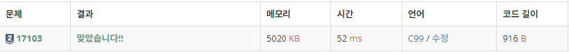

# 17103 골드바흐파티션

https://www.acmicpc.net/problem/17103

## 문제 이해

먼저 숫자를 받고 관련된 소수를 찾았다.(에라토스테네스의 체 이용)<br>
후에 소수리스트를 이용해서 각 숫자의 절반값까지 반복문을 돌리면서 확인하였다.<br>
소수 하나를 가지고 어떤 수를 만들 때 나머지 더하는 수가 소수인지 확인을 하는 과정을 반복하여 골드바흐파티션을 찾아내었다.

### 입력

첫째 줄에 테스트 케이스의 개수 T (1 ≤ T ≤ 100)가 주어진다. 각 테스트 케이스는 한 줄로 이루어져 있고, 정수 N은 짝수이고, 2 < N ≤ 1,000,000을 만족한다.

### 출력

각각의 테스트 케이스마다 골드바흐 파티션의 수를 출력한다.

## 풀이

```c
#include <stdio.h>

int prime_list[1000000] = {0,}; // 소수 리스트 소수 = 0, 아닌경우 1
int main(){
    int t, x;
    int re, maxx = 0;
    int list[100];

    scanf("%d", &t);
    for(int i = 0;i <t;++i){
        scanf("%d", &list[i]);
        if(list[i] > maxx)
            maxx = list[i];
    }
    prime_list[0] = 1;
    prime_list[1] = 1;
    // maxx값 기준 에라토스테네스의 체 시작
    for(int i =2;i < maxx;i++){
        if(prime_list[i] == 0){
            x = 2;
            while(i*x < maxx){
                prime_list[i*x++] = 1;
            }
        }
    }

    // 각 수마다 골드바흐 시작
    for(int j = 0;j < t;j++){
        re = 0;
        for(int z = 2;z < list[j]/2 + 1;z++){
            if(prime_list[z] == 0){
                if(prime_list[list[j] - z] == 0 )
                    re++;
            }
        }
        printf("%d\n", re);
    }

    return 0;
}

```

