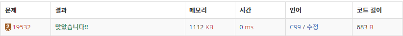

#19532 수학은 비대면 강의 입니다.

https://www.acmicpc.net/problem/19532

## 문제 이해

### 주의점

1) 수학 방정식을 풀듯이 풀면 나누기 때문에 곤란한 상황이 생긴다.
컴퓨터의 언어 저장 체계상 이상치가 나올 수 있다.
때문에 반복문으로 풀었다.<br>

2) 하지만 수학 공식을 이용해서 풀수도 있다.<br>
ax + by = c<br>
dx + ey = f<br>
이 때 역행렬을 이용해서 해를 구할 수 있다.<br>
X = (e*c - b*f)/(a*e - b*d)<br>
Y = (a*f - d*c)/(a*e - b*d)

### 입력

정수 a, b, c, d, e, f가 공백으로 구분되어 차례대로 주어진다.
(-999 < a,b,c,d,e,f < 999)
$$(-999 \leq a,b,c,d,e,f \leq 999)$$

문제에서 언급한 방정식을 만족하는
(x,y)가 유일하게 존재한다.

### 출력

문제의 답인 x와 y를 공백으로 구분해 출력한다.

## 풀이

```c
//1번 방법
#include <stdio.h>

int main(){
    int a, b, c, d, e, f;
    int x, y;
    scanf("%d %d %d %d %d %d", &a,&b,&c,&d,&e,&f);
    // x에 0 대입

    if(b == 0){
        x = c/a;
        printf("%d %d", x, (f - d*x)/e);
    }
    else{
        // for문으로 1, -1부터 999, -999까지 x에 대입
        for(x = 0;x < 1000;++x){
            y = (c - a*x)/b;
            if(d*x + e*y == f){
                printf("%d %d", x, y);
                break;
            }
            else{
                y = (c - a*(-x))/b;
                if(d*(-x) + e*y == f){
                    printf("%d %d",-x,y);
                    break;
                }
            }

        }

    }
}
```

```c
//2번 방법
#include <stdio.h>

int main(void) {
  int a, b, c, d, e, f;

  scanf("%d %d %d", &a, &b, &c);
  scanf("%d %d %d", &d, &e, &f);

  printf("%d %d", (c*e-f*b)/(a*e-d*b), (c*d-f*a)/(b*d-e*a));
  return 0;
}
```
