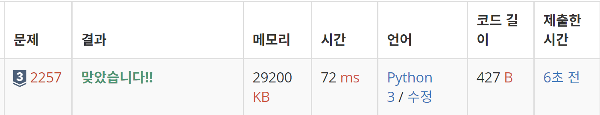

#2257 화학식량

https://www.acmicpc.net/problem/2257

## 문제 이해

### 규칙

CH(CO2H)3과 같은 화학식이 있을 때 화학식량을 계산하는 문제이다.<br>
#### H: 1 &nbsp;&nbsp; C: 12 &nbsp;&nbsp; O: 16<br>
무게로 정해져 있으며 화학식에 나오는 숫자는 원자 혹은 분자의 개수이다.

### 입력

첫째 줄에 화학식이 주어진다.<br>
화학식은 **H, C, O, (, ), 2, 3, 4, 5, 6, 7, 8, 9만으로 이루어진 문자열**이며,<br>
그 **길이는 100을 넘지 않는다.**

### 출력

첫째 줄에 **화학식량을 출력**한다.<br>
분자량이 10,000이 넘는 고분자는 입력으로 주어지지 않는다.

## Input 예시
### 1번

(H)2(O)

정답: 18

### 예외처리 하면서 넣었던 화학식

CH(CO2H)2(CO2H)

정답: 148

## 풀이

stack문제였다. 포인트는 '('를 넣어놓고 ')'가 들어오면 계산하는 것이었다.<br>
숫자가 분자와 원자에 모두 붙기 때문에 숫자가 나오면 무조건 -1번째의 값에 곱해 주었다.

```python
s = input()

atom_dic = {'H': 1, 'C': 12, 'O': 16}
stack = []
head = -1

for i in s:
    if i == '(':
        stack.append(i)
        head += 1
    elif i.isalpha():
        stack.append(atom_dic[i])
        head += 1
    elif i.isdigit():
        stack[head] *= int(i)
    else:
        tmp = 0
        while stack[head] != '(':
            tmp += stack.pop()
            head -= 1
        stack[head] = tmp

print(sum(stack))
```

