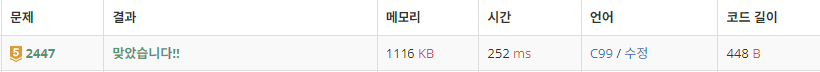

# 2447 별찍기 10

https://www.acmicpc.net/problem/2447

## 문제 이해

재귀함수 중 생각이 필요한 문제.<br>
덩어리를 잘 만들어서 논리 인덱스를 매길 줄 알아야 한다.<br>
중첩반복문 안에 함수를 시작하고 그 안에서 규칙에 따라 재귀를 시킨다.<br>
빈칸은 n이 주어졌을 때 임의의 x,y 좌표에서 n을 나누고 3으로 나눈 나머지를 확인했을 때 1이 나오면 빈칸을 만들어 준다.<br>
이 때 1이아니고 n이 1보다 크다면 n/3과 x, y를 인수로 재귀한다.

ex) n = 9일 때 x = 4, y = 3이라면, 처음에 (x/9)%3 = 1과 (y/9)%3 = 0을 확인한다.<br>
x,y가 모두 1이 아니므로 n/3 = 3과 3, 4로 다시 규칙에 만족하는지 확인한다.<br>
(x/3)%3 = 1과 (y/3)%3 = 1이므로 이제 이 칸이 빈칸이 되는 것을 확인 할 수 있다.

### 입력

첫째 줄에 N이 주어진다. N은 3의 거듭제곱이다. 즉 어떤 정수 k에 대해 N=3k이며, 이때 1 ≤ k < 8이다.

### 출력

첫째 줄부터 N번째 줄까지 별을 출력한다.

## 풀이

```c
#include <stdio.h>

int star(int n, int x, int y){
    if((x/n)%3==1 && (y/n)%3==1){
        printf(" ");
    }
    else{
        if(n == 1)
            printf("*");
        else
            star(n/3, x, y);
    }
    return 0;
}


int main(){
    int n;
    scanf("%d", &n);
    //star10(n, 0, 0);

    for(int x = 0; x < n;++x){
        for(int y = 0;y < n;++y) {
            star(n/3, x, y);
        }
        printf("\n");
    }
    return 0;
}
```


