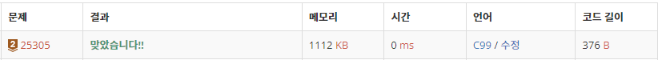

# 25350 커트라인

https://www.acmicpc.net/problem/25305

## 문제 이해

단순히 정렬을 하는 문제 커트가 빡빡하지 않아서 어떤 정렬로 해도 괜찮을 듯하다.
나는 c언어에서 count정렬을 이용하였으며
c++풀이는 라이브러리 참고용으로 첨부하였다.

### 입력

첫째 줄에는 응시자의 수
$N$과 상을 받는 사람의 수
$k$가 공백을 사이에 두고 주어진다.

둘째 줄에는 각 학생의 점수
$x$가 공백을 사이에 두고 주어진다.

$1 ≤ N ≤ 1\,000$

$1 ≤ k ≤ N$

$0 ≤ x ≤ 10\,000$

### 출력

상을 받는 커트라인을 출력하라.

## 풀이

```c
#include <stdio.h>

int main() {
    int n, k, x, tmpk;
    int score[10001] = {0,};
    int re;

    scanf("%d %d", &n, &k);
    for (int i = 0; i < n; i++) {
        scanf("%d", &x);
        score[x] += 1;
    }
    tmpk = 0;
    for(re = 10001;re>=0;re--){
        tmpk += score[re];
        if(tmpk >= k){
            printf("%d", re);
            break;
        }
    }
}
```

```c++
//c++방법(라이브러리)
#include <iostream>
#include <algorithm>

using namespace std;

int n, k;
int arr[1001];

int main() {
    cin >> n >> k;
    for(int i = 0; i < n; i++) cin >> arr[i];
    sort(arr, arr + n);
    cout << arr[n-k] << '\n';
}
```

