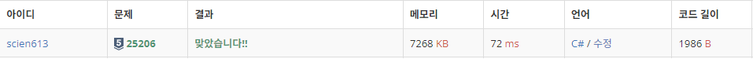

# 25206 너의 평점은

https://www.acmicpc.net/problem/25206

## 문제 이해

학점과 등급으로 평점을 구하는 문제

C#에 Split이 구현되어있어 편하게 풀었다.

### 입력

20줄에 걸쳐 치훈이가 수강한 전공과목의 과목명, 학점, 등급이 공백으로 구분되어 주어진다.

### 출력

치훈이의 전공평점을 출력한다.

정답과의 절대오차 또는 상대오차가
\(10^{-4}\) 이하이면 정답으로 인정한다.

## 풀이
```c
using System;

namespace _25206
{
    class Program
    {
        static void Main(string[] args)
        {
            float re = 0;
            float credit = 0;
            for(int i = 0;i < 20; i++)
            {
                string s = Console.ReadLine();
                string[] ss = s.Split();
                switch (ss[2])
                {
                    case "A+":
                        re += 4.5f* float.Parse(ss[1]);
                        credit += float.Parse(ss[1]);
                        break;
                    case "A0":
                        re += 4f* float.Parse(ss[1]);
                        credit += float.Parse(ss[1]);
                        break;
                    case "B+":
                        re += 3.5f*float.Parse(ss[1]);
                        credit += float.Parse(ss[1]);
                        break;
                    case "B0":
                        re += 3f*float.Parse(ss[1]);
                        credit += float.Parse(ss[1]);
                        break;
                    case "C+":
                        re += 2.5f*float.Parse(ss[1]);
                        credit += float.Parse(ss[1]);
                        break;
                    case "C0":
                        re += 2f*float.Parse(ss[1]);
                        credit += float.Parse(ss[1]);
                        break;
                    case "D+":
                        re += 1.5f*float.Parse(ss[1]);
                        credit += float.Parse(ss[1]);
                        break;
                    case "D0":
                        re += 1f*float.Parse(ss[1]);
                        credit += float.Parse(ss[1]);
                        break;
                    case "F":
                        credit += float.Parse(ss[1]);
                        break;
                    default:
                        break;
                }
            }

            Console.WriteLine(re / credit);
        }
    }
}
```
