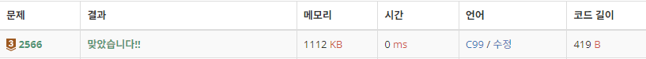

# 10815 숫자카드

https://www.acmicpc.net/problem/2566

## 문제 이해

스피드런으로 풀이한 최댓값문제<br>
10분 정도 걸린거같은데 그렇게 빨리 푼건 아닌거같다.

### 입력

첫째 줄부터 아홉 번째 줄까지 한 줄에 아홉 개씩 수가 주어진다. 주어지는 수는 100보다 작은 자연수 또는 0이다.

### 출력

첫째 줄에 최댓값을 출력하고, 둘째 줄에 최댓값이 위치한 행 번호와 열 번호를 빈칸을 사이에 두고 차례로 출력한다. 최댓값이 두 개 이상인 경우 그 중 한 곳의 위치를 출력한다.
## 풀이

```c
#include <stdio.h>

int main(){
    int max = 0;
    int n, locx = 1;
    int locy = 1;
    for(int i = 1 ; i < 10;++i){
        for(int j = 1; j < 10;++j){
            scanf("%d", &n);
            if (max < n){
                max = n;
                locx = i;
                locy = j;
            }
        }
    }
    printf("%d\n", max);
    printf("%d %d", locx, locy);
}
```


