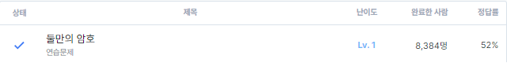

# 둘만의 암호(level1)

https://school.programmers.co.kr/learn/courses/30/lessons/155652#

## 문제 이해

s 문자열에서 각 알파벳을 index만큼 뒤로 미루는 문제<br>
z에서 a로 가는 순환구조였고 skip알파벳을 지정한 것외에 특별한 내용은 없었다.<br>
C#으로 처음 풀어본 문제이기에 적당했다고 생각한다.

### 입출력 예

| s	       | skip | index |result|
|----------|------|-------|---|
| "aukks"	 | "wbqd"| 5     |"happy"|

## 풀이

```c
using System;

public class Solution {
    public string solution(string s, string skip, int index) {
        string answer = "";
        int count;
        int ascii;
        for(int i = 0;i < s.Length;++i){
            count = 0;
            ascii = (int)s[i];
            
            while(count < index){
                
                if(ascii >= 122)
                    ascii = 97;
                else
                    ascii++;
                if(!skip.Contains((char)ascii)){
                    count++;
                }
            }
            //Console.Write("{0} {1}\n", ascii, (int)'z');
            answer += (char)ascii;
            
        }
        return answer;
    }
}
```

