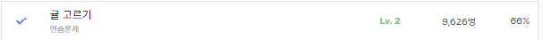

# 귤 고르기(level2)

https://school.programmers.co.kr/learn/courses/30/lessons/138476

## 문제 이해

수확한 귤을 크기별로 분류 후에 한 상자에 최소한의 종류가 들어가도록 귤을 담는 문제<br>
이 때 수확한 귤의 크기 종류 배열과 크기별 개수를 저장하는 배열하나를 따로 만들어서 귤 데이터를 정리하고<br>
귤의 크기별 개수 배열만 내립차순으로 정렬하여 k를 넘을 때까지 더한 횟수를 출력하였다.

### 입출력 예

|k	| tangerine|result|
|--|---|---|
|6	|[1, 3, 2, 5, 4, 5, 2, 3]	|3|
|4	|[1, 3, 2, 5, 4, 5, 2, 3]	|2|
|2	|[1, 1, 1, 1, 2, 2, 2, 3]	|1|

## 풀이

```c
#include <stdio.h>
#include <stdlib.h>

int comp(const void *n, const void *m){
    int a = *(int *)n;
    int b = *(int *)m;
    if(a > b)
        return -1;
    else if(b>a)
        return 1;
    else
        return 0;
}


// tangerine_len은 배열 tangerine의 길이입니다.
int solution(int k, int tangerine[], size_t tangerine_len) {
    int answer = 0;
    int* tan_l = (int*)malloc(sizeof(int)*tangerine_len);
    int* tan_count_l = (int*)malloc(sizeof(int)*tangerine_len);
    int type_tan = 0;
    int tan_lcount = 0;
    bool tan_bool;

    for(int i = 0;i < tangerine_len;++i){
        tan_bool = true;
        for(int j = 0;j < tan_lcount;++j){
            if(tangerine[i] == tan_l[j]){
                tan_count_l[j] += 1;
                tan_bool = false;
            }

        }
        if(tan_bool){
            tan_l[tan_lcount] = tangerine[i];
            tan_count_l[tan_lcount++] = 1;
        }

    }

    qsort(tan_count_l, tan_lcount, sizeof(int), comp);

    while(k>type_tan){
        type_tan += tan_count_l[answer++];
    }
    return answer;
}
```

